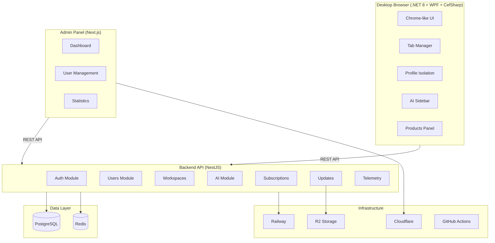

# Arquitectura - Madsjeez Seller Browser

## Visión general



## Aislamiento de perfiles

Cada workspace (perfil) mantiene:

```
%LOCALAPPDATA%/MadsjeezSellerBrowser/
├── Profiles/
│   ├── maqjeez/          # Cache CefSharp aislado
│   └── materia-natural/  # Cache CefSharp aislado
├── settings.enc          # Config cifrada (DPAPI)
└── profiles.json         # Definición de perfiles
```

## Seguridad

| Capa | Implementación |
|------|----------------|
| Autenticación | JWT (15min) + Refresh tokens (7 días) |
| Almacenamiento local | Windows DPAPI (ProtectedData) |
| Rate limiting | @nestjs/throttler |
| Headers | Helmet.js |
| Validación | class-validator + whitelist |
| CSRF | SameSite cookies + CORS restrictivo |
| Contraseñas | bcrypt (12 rounds) |

## Módulos preparados para futuro

La arquitectura soporta extensión hacia:

- **Publicación masiva:** Products module + queue (Redis)
- **Sync de stock:** Webhooks + Products API
- **CRM:** Nuevo módulo `crm` con relaciones User → Contacts
- **Multi-cuenta:** Workspace isolation ya implementado
- **Comparador de precios:** AI module + scraping service
- **Marketplace integrado:** Products + new `listings` module

## API Endpoints

Base URL: `/api/v1`

| Módulo | Endpoints |
|--------|-----------|
| Auth | POST /auth/register, /login, /refresh, /logout |
| Users | GET /users, PUT /settings/browser |
| Workspaces | CRUD /workspaces |
| Products | CRUD /products |
| AI | POST /ai/generate, GET /ai/history |
| Subscriptions | GET /subscriptions/me |
| Updates | GET /updates/check?version=x |
| Telemetry | POST /telemetry/track |
| Favorites | CRUD /favorites |
| Notifications | GET /notifications |

## Base de datos

Ver `backend-api/prisma/schema.prisma` para el esquema completo con 12 tablas y relaciones.
